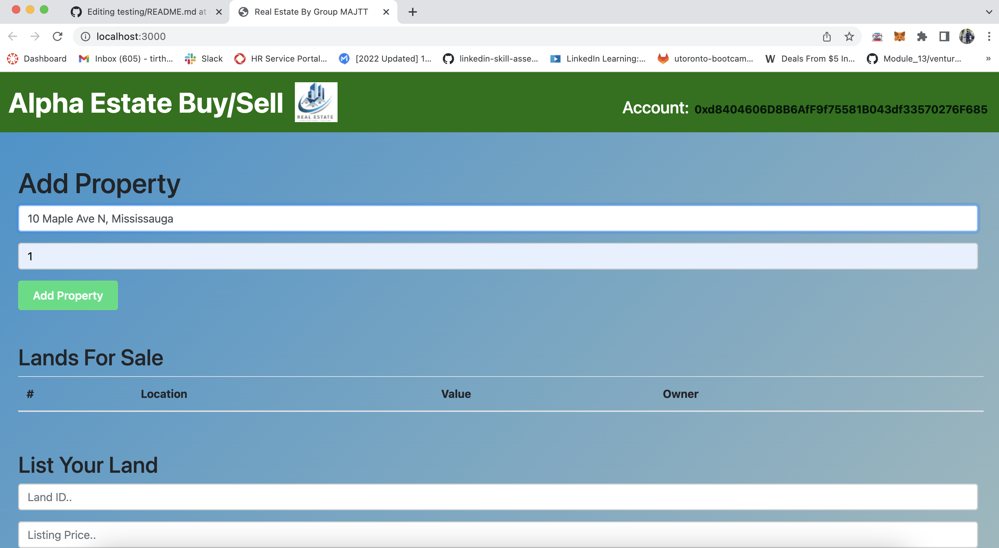
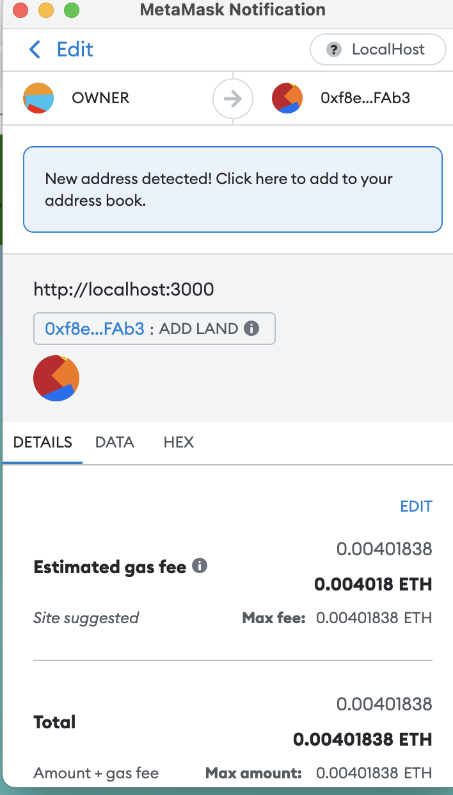
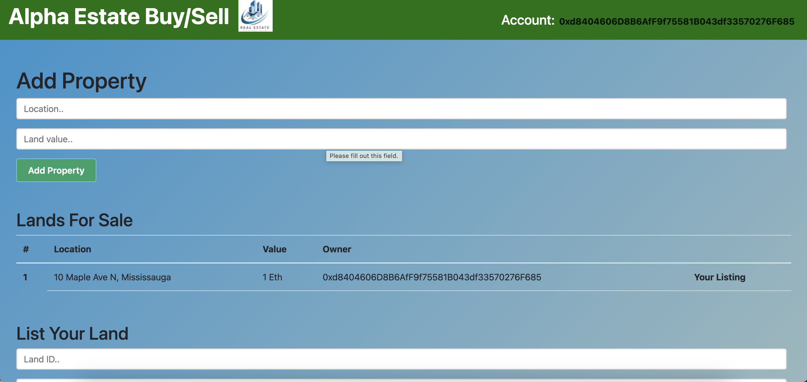
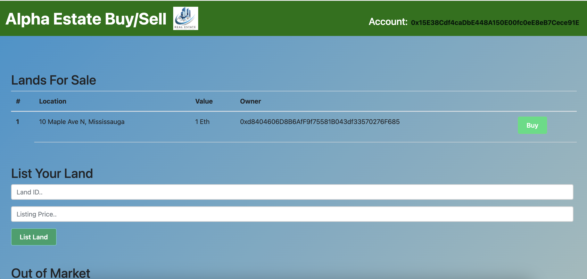
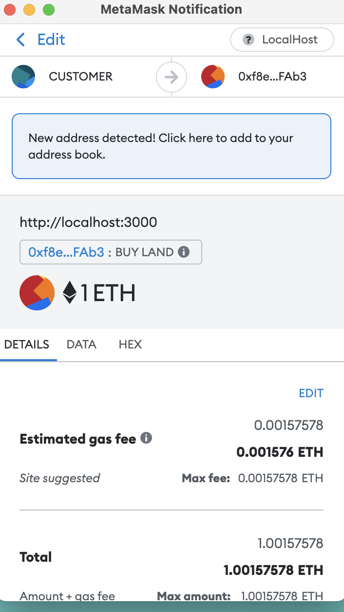
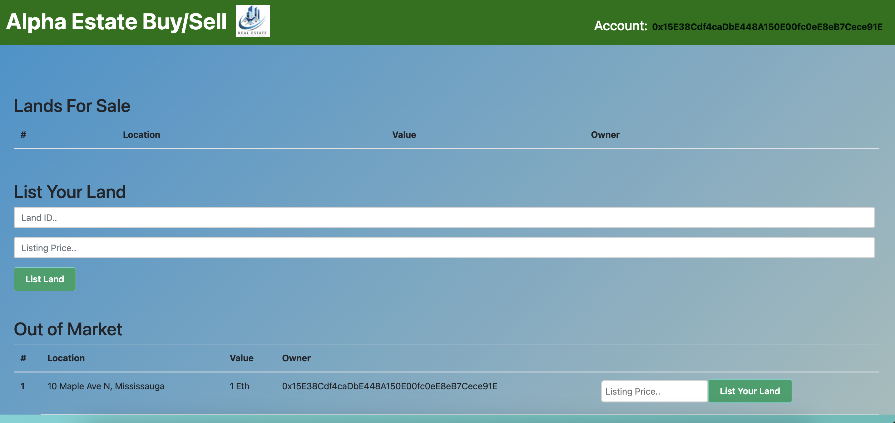

# Alpha Estates DAPP

<h2>Getting Started</h2> 

Global dependencies -  
•	Node @9.10.0  
•	Truffle @5.0.5  
•	Node-gyp @3.6.2  

Other -  
•	Ganache  
•	Metamask Extension for Google Chrome  

1. Start by cloning this repo  
2. Inside the new folder, npm install to install all req'd dependencies  
3. Open up Ganache and click 'Quick Start'  
5. Go to your terminal, cd your folder and '<strong>truffle compile</strong>' to compile your contracts  
6. Then migrate your contracts to deploy to our local blockchain aka ganache - '<strong>truffle migrate</strong>'  
7. Go to your metamask extension and create a new network configured to your Ganache network. In that network, import a new account w/ one of the private keys inside your Ganache.  
8. '<strong>npm start</strong>' to load up the project on your local browser. (make sure you're on your ganache network in your metamask extension)  

9. From owner acc. add a property

10. MetaMask confirmation for listing the property

11. Owner will be having one listed property

12. Change acc. to customer acc.

13. Buy the property for 1 Ether 

14. After buying the property will go out of market and if you want sell it again you can use listing tab and change the ether value

